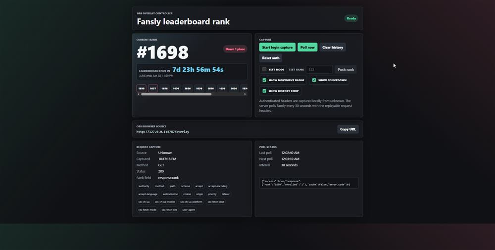
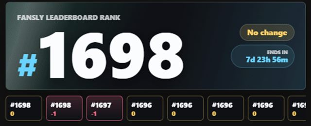
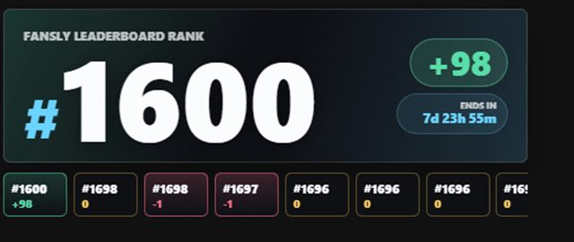

# Fansly OBS Leaderboard Overlay

Local app for an OBS browser source that displays your Fansly leaderboard rank, updates every 30 seconds, shows movement since the last poll, keeps a short rank history, and counts down to the current leaderboard end time.

## Preview

Dashboard:



Overlay leaderboard movement:



Overlay rank increase:



## Run

```powershell
npm.cmd install
npm.cmd start
```

Starting the app opens the dashboard in your default browser automatically.

Dashboard:

```text
http://127.0.0.1:8787/
```

OBS browser source:

```text
http://127.0.0.1:8787/overlay
```

Fallback OBS URL if a local browser extension blocks paths named `overlay`:

```text
http://127.0.0.1:8787/obs
```

Recommended OBS browser source size: `620 x 250`. Enable transparent background if your OBS setup exposes that option.

## Test Mode

Use `Test mode` on the dashboard to preview overlay animations without calling Fansly.

1. Turn on `Test mode`.
2. Enter a rank in `Test rank`.
3. Click `Push rank`.
4. Enter another rank to test up/down movement.

Live polling pauses while test mode is on. Test ranks are not saved into the real rank history; turning test mode off restores the live display state.

## Overlay Toggles

The dashboard can hide the movement badge (`+1`, `-1`, `No change`), countdown, and history strip independently. The rank stays visible.

## Overlay Customization

Use the `Overlay customization` panel on the dashboard to change the overlay title, the two background gradient colors, and the animated swipe color. These settings are saved locally under `data/`, so they survive app restarts without being included in the repository.

## Login Capture

1. Open the dashboard.
2. Click `Start login capture`.
3. A Playwright Chromium window opens. Log in to your own Fansly account there.
4. Manually open the Fansly leaderboard in that same Chromium window.
5. Once the app sees the authenticated request to `getActualUserRank/v1`, it stores the request headers, response header names, cookies, and rank history encrypted locally under `data/`.

The login capture starts on `https://fansly.com/`, not `leaderboard.fansly.com`. The dashboard intentionally shows only header names, not token values. Keep the `data/` folder private because it contains local session material.

## Local Data Encryption

The app encrypts its local JSON data files with AES-256-GCM before writing them to `data/`. Existing plaintext JSON files are migrated automatically on startup. On Windows, the generated encryption key is protected with the current Windows user through DPAPI when available. On other systems, set `FANSLY_OVERLAY_SECRET` before the first run if you want the local key protected by your own secret.

The Playwright Chromium profile also lives under `data/` so the login browser can stay signed in. Treat the whole `data/` folder as private and use `Reset auth` if you want to remove captured session material.

## Settings

You can override defaults with environment variables before starting:

```powershell
$env:PORT = "8787"
$env:POLL_MS = "30000"
$env:FANSLY_RANK_ENDPOINT = "https://leaderboard.fansly.com/leaderboard/getActualUserRank/v1/?ngsw-bypass=true"
$env:FANSLY_LEADERBOARD_INFO_ENDPOINT = "https://leaderboard.fansly.com/leaderboard/getCurrentLeaderboard/v1/?v=1&ngsw-bypass=true"
$env:FANSLY_OVERLAY_SECRET = "optional local encryption secret"
npm.cmd start
```

To start the server without opening the browser:

```powershell
$env:NO_OPEN = "1"
npm.cmd start
```

`LOGIN_HEADLESS=1` is supported, but the normal headed Chromium mode is recommended because Fansly may require interactive login or verification.

## Notes

Use this only with an account and session you are authorized to access. If Fansly changes its leaderboard response shape, the app searches common rank fields such as `actualRank`, `userRank`, `currentRank`, `rank`, `position`, and `place`; the dashboard shows the field path it used. The leaderboard countdown uses `response.leaderboard.ends_at` from the current leaderboard endpoint.
